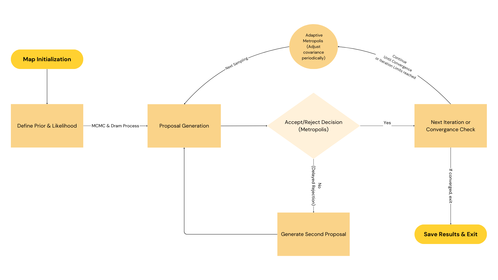

### ⚠️ Disclaimer and Authorship
This repository contains original work developed as part of an academic research collaboration under the supervision of Professor Alex Gorodetsky at the University of Michigan.

The repository has been made public with permission from the supervising professor, strictly for educational and professional portfolio purposes.

While this project uses the HallThruster.jl framework maintained by the UM PEPL Lab, the parameter estimation workflows, Python integration, MCMC and MAP methods, and associated YAML validation systems were implemented and customized by the contributor.

This repository does not represent official releases or endorsements by the HallThruster.jl developers or the University of Michigan Plasma, Pulsed Power, and Microwave Laboratory.

---
## Project Overview

In computational modeling, **model error** (also known as structural error or model inadequacy) refers to the
gap between a model’s predictions and actual system behavior due to limitations in the model’s structure.
This discrepancy typically arises from simplifications, assumptions, or incomplete knowledge of complex
physical processes. Such errors are especially prominent in complex systems where simplified models cannot
fully represent underlying dynamics.
In many applications, model error is one of the largest sources of uncertainty in predictions, often more
significant than measurement noise or parameter estimation uncertainty. Conventional model calibration
methods generally assume that the model structure is correct and focus on optimizing model parameters,
which can lead to biased parameter estimates and overconfident predictions. Addressing model error
directly allows us to create models that better reflect physical reality, yielding predictions with more reliable
uncertainty quantification.

### Overall Approach to Address Model Error
To address model error, we employ Bayesian model calibration with an embedded model error representation. This approach incorporates model error directly within the model structure as an internal correction,
rather than treating it as an external adjustment on specific quantities of interest. By embedding model error,
we achieve a physically consistent correction that respects the model’s underlying dynamics and constraints.
### Application to the Hall Thruster Model
The Hall thruster, a plasma propulsion device commonly used in spacecraft, serves as the application context
for this study. Modeling the Hall thruster involves capturing complex plasma dynamics and anomalous
electron transport processes, which are challenging to represent accurately. We aim to reduce the model
error by calibrating a simplified model using a higher-fidelity truth model as the benchmark.

This project aims to optimize the behavior of a Hall Thruster using the **HallThruster.jl** Julia package, integrated with Python through Juliacall. The project involves parameter estimation using MCMC sampling, incorporates DRAM algorithm, and MAP optimization, providing tools for comparison between simulated and observed data. It employs Bayesian inference techniques to refine the parameters of the **TwoZoneBohm** and **MultiLogBohm** models.


---

## 2.1 Configuration


#### We follow the configuration steps as outlined in Hallthruster.jl tutorials. 
We define the core configuration parameters used in the Hall thruster simulation. These values are based on the standard setup for realistic SPT-100 operating conditions. Please see the links below:

- [HallThruster.jl (v0.18.1)](https://um-pepl.github.io/HallThruster.jl/dev/)
- [Simulation Tutorial](https://um-pepl.github.io/HallThruster.jl/dev/tutorials/simulation/)
- [Running Simulations from JSON](https://um-pepl.github.io/HallThruster.jl/dev/howto/json/)
- [Using HallThruster with Python](https://um-pepl.github.io/HallThruster.jl/dev/howto/python/)


### Thruster Model
- **Type:** SPT-100 Hall Thruster  
- **Description:** A widely used electric propulsion device for spacecraft missions.

### Spatial Resolution and Grid
- **Number of Grid Cells:** 100  
- **Channel Length:** 0.025 meters  
- **Grid Type:** 1D along channel axis

### Simulation Duration
- **Total Duration:** 1 millisecond (`duration_s = 1e-3`)  
- **Data Save Interval:** Every 10 microseconds (`num_save = 100`)

### Magnetic Field and Boundary Conditions
- **Magnetic Field Source:** `bfield_spt100.csv` (external file with field profile)  
- **Anode Potential:** 300 V  
- **Cathode Potential:** 0 V

### Additional Model Configurations

- **Propellant:** Xenon  
- **Wall Material:** Boron Nitride-Silicon Dioxide (BNSiO₂)

#### Thermal and Flow Conditions
- **Ion Temperature:** 1000 K  
- **Neutral Temperature:** 500 K  
- **Neutral Velocity:** 150 m/s

#### Anomalous Transport Coefficients
### Anomalous Transport Coefficients

The anomalous collision frequency ν_AN(z) is modeled as:

    ν_AN(z) = c(z) * ω_ce(z),  for z in [0, L]

where:
- ν_AN(z): anomalous electron collision frequency
- ω_ce(z): electron cyclotron frequency
- c(z): empirical coefficient function (dimensionless)
- L: channel length (e.g., 0.025 m)

## Truth Model: MultiLogBohm

The **MultiLogBohm** model is a high-fidelity simulation of the Hall thruster. It accurately captures plasma interactions and transport behaviors, serving as the "ground truth" for ion transport, current, and thrust.

### Anomalous Collision Frequency

The anomalous collision frequency is defined as:

```
nu_AN(z) = c(z) * omega_ce(z)
```

where:
- `omega_ce(z)`: electron cyclotron frequency at position `z`
- `c(z)`: spatially varying empirical coefficient

The function `c(z)` is defined via logarithmic interpolation between nodes `(z_i, c_i)`:

```
log(c(z)) = [(z - z_i) / (z_{i+1} - z_i)] * log(c_{i+1}) + [(z_{i+1} - z) / (z_{i+1} - z_i)] * log(c_i),
for z_i < z < z_{i+1}
```

Outside the range:
```
c(z) = c_1        if z < z_1
     = c_end      if z > z_end
```

### Data

Observed time-averaged measurements under specific operating conditions:
- **Ion Velocity** at normalized positions:
```
z_normalized = [0.0, 0.19, 0.39, 0.59, 0.79, 0.99, 1.19, 1.39, 1.59, 1.79, 1.99]
```
- **Discharge Current**
- **Thrust**

### Time-Averaging Process

1. Discard first 40% of simulation frames.
2. Average remaining frames for each observable.

Simulation duration: `X` seconds. Time averaging starts at `Y = 0.4 * X`.

For ion velocity, spatial subsampling uses:
```
save_every_n_grid_points = 10
```

---

## Baseline Model: TwoZoneBohm

The **TwoZoneBohm** model splits the channel into two zones:

```
nu_AN = c_1 * omega_ce    if z < L_ch
      = c_2 * omega_ce    if z >= L_ch
```

This model is computationally efficient but introduces structural error due to reduced spatial flexibility.

---


## **Table of Contents**
1. [Methods](#methods)
2. [Requirements](#requirements)
3. [Installation](#installation)
   - [Dependency Management](#using-pdm-for-dependency-management)
   - [HallThruster.jl Installation](#hallthrusterjl-installation)
4. [Run Project](#run-project)
8. [Contact](#contact)


## **Methods**

1. **Configuration:**  
   - Define simulation parameters and model settings in a configuration file. 
   - Specify options for simulation, optimization, and visualization to create a customized thruster model.

2. **Data Generation:**  
   - Generate synthetic or experimental ground truth data based on the defined configuration.  

3. **MAP (Maximum A Posteriori) Optimization:**  
   - Estimate the optimal parameter values using the chosen anomalous transport models (e.g., `TwoZoneBohm`, `MultiLogBohm`).  
   - Optimizate to minimize the error between simulated and observed data.

4. **MCMC (Markov Chain Monte Carlo) Sampling:**  
   - Conduct Bayesian inference to obtain parameter distributions.  
   - Use MCMC techniques (e.g., Delayed Rejection Adaptive Metropolis) to quantify uncertainty.

5. **Visualization and Analysis:**  
   - Generate plots and statistical summaries to analyze parameter convergence and posterior distributions.  
   - Compare simulation results against observed data for model validation.


## Likelihood Model

A Gaussian likelihood is used:
```
y = y_hat + epsilon,    epsilon ~ N(0, sigma^2)
```

### Log-Likelihoods

**Thrust:**
```
log L_thrust = -0.5 * [(y_thrust - y_hat_thrust) / sigma_thrust]^2 - 0.5 * log(2 * pi * sigma_thrust^2)
```

**Discharge Current:**
```
log L_dc = -0.5 * [(y_dc - y_hat_dc) / sigma_dc]^2 - 0.5 * log(2 * pi * sigma_dc^2)
```

**Ion Velocity (over M points):**
```
log L_ion_velocity = -0.5 * sum over j [(y_ion_velocity[j] - y_hat_ion_velocity[j]) / sigma_ion_velocity]^2
                     - 0.5 * M * log(2 * pi * sigma_ion_velocity^2)
```

**Total:**
```
log L(y | theta) = log L_thrust + log L_dc + log L_ion_velocity
```

---

## Priors

**Gaussian Prior on** `log10(c1)`:
```
log10(c1) ~ N(log10(1/160), 2)
```

**Log-Uniform Prior on** `log10(alpha)`:
```
log10(alpha) ~ Uniform(0, 2)
```

---

## MCMC Sampling (DRAM)

We use Delayed Rejection Adaptive Metropolis (DRAM) for Bayesian parameter estimation.




## **Requirements**

To run this project, ensure the following dependencies are installed:

#### **Python**
- Python 3.10 or later
- Required Python packages (from `requirements.txt`):
  - `numpy`
  - `scipy`
  - `matplotlib`
  - `pydantic`
  - `pyyaml`
  - `MCMCIterators`
  - `arviz` *(for MCMC analysis)*

#### **Julia**
- Julia 1.10 or later
- Install the **HallThruster** package using Julia's package manager.

---

## **Installation**


1. **Clone the repository:**
    ```
    git clone https://github.com/gorodetsky-umich/model_error_uq_plasma.git
    cd model_error_uq_plasma
    ```

2. **Create a virtual environment and activate it:**
    ```bash
    python -m venv .venv
    # On Windows
    .venv\Scripts\activate

    # On Ubuntu/MacOS
    python3 -m venv .venv   
    source .venv/bin/activate
    ```

## **Dependency Management**

[PDM (Python Dependency Manager)](https://pdm-project.org) offers a more streamlined way to manage dependencies and virtual environments.


#### **Step 2: Install PDM**

If you don't have PDM installed, install it via:

```bash
python pip install pdm
```

#### **Step 3: Install dependencies with PDM**

Install dependencies:

```bash
pdm install
```

Verify the required packages are available in your environment.

```bash
pdm list
```

> **Note:** If you encounter an error such as `pdm not >found`, try run `python -m pdm install` instead of `pdm install`. 
>
> To check if any installed Python packages, including PDM, > need an update:
> ```
    > python -m pip list --outdated
>    
 
>If pdm appears in the list, update it using:

 ```
 python -m pdm self update
 python -m pip install --upgrade pip
 ```
    

#### **Step 4: Activate the PDM virtual environment**

```
pdm venv activate
```
### Auto-Activation in ~/.bashrc, ~/.zshrc (optional)
    '''
    function cd {
        builtin cd "$@"
        # bash regex pdm-test / conditionally activate the venv in the current shell 
        if [[ "$PWD" =~ pdm-test ]]
        then
            eval $(pdm venv activate)
        fi
    }
    '''
---

> **Note:** **Troubleshooting Dependency Conflicts**  
> If you encounter dependency resolution issues (such as conflicts with package versions, e.g., pandas), try the following commands to resolve them:  
>  
> ```bash
> pdm update --unconstrained
> pdm lock --refresh
> ```  
>  
> These commands will relax dependency constraints and attempt to find compatible versions automatically.

---
### HallThruster Installation and Python Integration
To ensure HallThruster works correctly with Python, follow these steps to install and integrate it:

1. **Install Julia (1.10 or later)** from [Julia Official Website](https://julialang.org/downloads/)


#### Ensure Julia is installed and run:
   ```
    where julia  # Windows
    which julia  # macOS/Linux
   ```
---

#### 1. Install HallThruster.jl in Julia


    ```
    mkdir hallthruster_project && cd hallthruster_project
    ```

1. Open Julia and activate your project environment:

   ```julia
   julia
   ```
If it’s not found, add it to PATH or reinstall Julia.
 Activate the project and install the package:

   ```julia
   (@v1.10) pkg> activate .
   (@v1.10) pkg> add HallThruster
   ```
placeholder half replace the hallthruster jls.e

---
If you experience import errors, run the following in Julia:

    julia```
    using Pkg
    Pkg.add("HallThruster")

Check if the package installation was successful:

    julia```
        using Pkg
        Pkg.status()
    ```

After installation, find the Python script path by running the following command in Julia:

```julia
using HallThruster; 
HallThruster.PYTHON_PATH
```

Once the environment is set, you can test if `HallThruster` is available in Python:

    ```python
    import hallthruster as het

    # Check if the module is loaded correctly
    print("hallThruster successfully imported!")
    ```

    If `HallThruster` is available, the script will proceed normally.  
    If not available, `main.py` will manually attempt to add it.

    ---

### 3: TROUBLESHOOT: Manually Add the Path in `main.py`

If hallthruster is still not found, in `main.py`,  edit the snippet below (located at the top of main.py) and replace the placeholder with your hallthruster python path, 
This will check if `HallThruster` is accessed. If not, it will add the path:

    ```python
    import sys

    # Ensure HallThruster module is in the Python path
    hallthruster_path = "/Users/your-name/.julia/packages/HallThruster/abc/python"
    if hallthruster_path not in sys.path:
        sys.path.append(hallthruster_path)

    import hallthruster as het
    print("HallThruster imported successfully in main!")

    ```


---
---
## 2: Automatic Setup via `run.py`

#### After hallthruster installation is completed, you are ready to run the project. See the guide for running the project below.

---

### **Run Project**

This project uses [PDM](https://pdm-project.org/) for managing dependencies and executing tasks. The `run.py` script serves as the main entry point, handling essential setup before launching the core logic.

**1. Install Dependencies (If not already done):**

```
    pdm install
```
**2. Execute the Analysis:**

Use the PDM script command defined in pyproject.toml (see the manually added entry `main = "python run.py"`  in the toml file) This allows define the console script entry points within the package. Now, we can easily run:

```
    pdm run main my_project.yaml
```

### Example:
```
    pdm run main configuration.yaml
```

#### Note: 

This command can be run from any directory within the project. PDM ensures correct execution from the project root. See link here for more details: https://pdm-project.org/latest/usage/scripts/ 

---
    

##               YAML VALIDATION & DEFAULTS WORKFLOW

Here is a breakdown of the internal steps typically taken after the project is launched via pdm run main 'my_project.yaml'. 

#### 1. START PROCESS
   ------------------------------------------------------------
- Main script execution begins in `main.py`.
- The YAML configuration file is read from command-line args.

#### 2. PARSE YAML CONFIGURATION
   ------------------------------------------------------------
- Read the YAML file using `load_yaml()`.
- Convert YAML content into a Python dictionary.

#### 3. VERIFY YAML CONTENT & CREATE DEFAULTS (Pydantic Validation)
   ------------------------------------------------------------
- `verify_all_yaml(yaml_data)` validates the config.
- If fields are missing, Pydantic assigns default values:
- `gen_data = False`
- `thruster = "SPT-100"`
- `anom_model = MultiLogBohm (default values)`
- If verification fails, exit process.

   ------------------------------------------------------------

#### 4. RESOLVE FILE PATHS

- Calls `resolve_yaml_paths(settings)`.
- Converts relative paths to absolute paths.

------------------------------------------------------------
#### 5. OVERRIDE DEFAULT SETTINGS WITH USER-SPECIFIED VALUES

- Flags from YAML (`gen_data`, `run_map`, etc.) override defaults.
- `setattr(settings.general, flag, value)` applies overrides.
------------------------------------------------------------

#### 6. CREATE RESULTS DIRECTORY

- Ensures `results_test/` directory exists.
- Creates subdirectories dynamically.
------------------------------------------------------------

#### 7. VALIDATE `gen_data` FLAG & RUN DATA GENERATION

- If `gen_data=True`:
- Calls `generate_ground_truth(settings)`.
- Runs `run_model()` to create synthetic data.
- Saves results in `results_test/postprocess/output_multilogbohm.json`.
- If `gen_data=False`, loads existing ground truth data.


#### 8. ERROR HANDLING & EXCEPTION MANAGEMENT
------------------------------------------------------------
- If missing config keys (`KeyError`), print error and exit.
- If `thruster` is None, assign a default model.
- If ground truth data is missing, stop execution.
------------------------------------------------------------

#### 9. CONTINUE EXECUTION OR EXIT

- If YAML is valid, execution continues to MAP/MCMC steps.
- If errors occur, exit process.
------------------------------------------------------------
#### 10. END PROCESS

- All settings are finalized.
- Ready to proceed with the next computational steps.

### Results directory:
```
model_error_uq_plasma/
│── hall_opt/
│   ├── main.py             # Main execution script
│   ├── results/            # Your output directory
│   ├── config/             # Configuration files
│   ├── scripts/            # Method scripts
│   ├── utils/              # Helper scripts
│   ├── posterior/          # Posterior calculations
│── run.py                  # Entry point
│── README.md               # Documentation
│── pyproject.toml          # Python dependencies (PDM)
│── .venv/                  # Virtual environment
```

## **Contact**

For any questions or issues, contact:

- **Name:** Elida Sensoy  
- **Email:** elsensoy@umich.edu  

